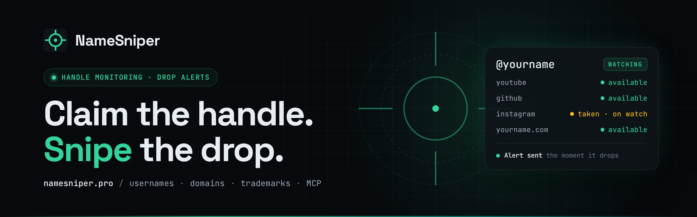

<p align="center">
  <a href="https://namesniper.pro">
    
  </a>
</p>

<p align="center">
  <a href="https://namesniper.pro"></a>
  <a href="https://namesniper.pro/docs/api"></a>
  <a href="https://www.npmjs.com/package/namesniper-mcp"></a>
  <a href="https://doi.org/10.5281/zenodo.22904856"></a>
</p>

<p align="center">
  <b>One search checks a name across every major social platform, 20+ domain extensions and the USPTO.<br>
  Put any taken handle on watch and get one verified alert the moment it drops.</b>
</p>

---

### 🎯 What NameSniper does

|  |  |
|---|---|
| **Check** | Username, domain and trademark availability in one sweep, with a confidence score on every verdict. [Try it →](https://namesniper.pro/check) |
| **Monitor** | Watch taken handles and get alerted by email, Discord, Slack or webhook when they free up. [Watch a handle →](https://namesniper.pro/monitor) |
| **Generate** | AI brand names, checked for availability before you fall in love with one. [Generate →](https://namesniper.pro/generate) |
| **Build** | REST API and a remote MCP server, so your agents can check and watch names too. [Docs →](https://namesniper.pro/docs/api) |

### 📦 Open source and open data

| Repo | What's inside |
|---|---|
| [**NameSniper-MCP**](https://github.com/NameSniperPro/NameSniper-MCP) | MCP server for Claude, Cursor and any MCP client. Check names, domains and handles, then watch the taken ones. |
| [**username-rules**](https://github.com/NameSniperPro/username-rules) | Machine-readable username rules per platform: length limits, tested regex patterns and drop policies, each linked to official docs. |
| [**namesniper-datasets**](https://github.com/NameSniperPro/namesniper-datasets) | First-party data on username scarcity and handle markets: Telegram username sales, Roblox and Kick namespace studies. CC BY 4.0. |

### ⚡ Plug it into your AI client

```json
{
  "mcpServers": {
    "namesniper": { "url": "https://namesniper.pro/mcp" }
  }
}
```

Checking is free and needs no account. Setup for every client lives in the [MCP repo](https://github.com/NameSniperPro/NameSniper-MCP).

### 🔗 Links

[Website](https://namesniper.pro) · [Research](https://namesniper.pro/research) · [Methodology](https://namesniper.pro/methodology) · [Pricing](https://namesniper.pro/pricing) · [Blog](https://namesniper.pro/blog) · [info@namesniper.pro](mailto:info@namesniper.pro)

<sub>Using our data? Credit NameSniper with a link to <a href="https://namesniper.pro/research">namesniper.pro/research</a>. That's the only condition.</sub>
